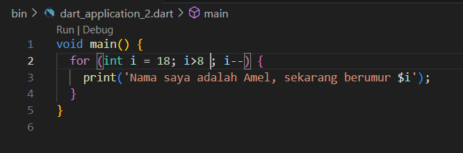
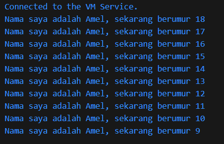

NAMA  : AMELIA WAHYU SAFITRI

KELAS : SIB-3D

NIM   : 2241760008

# JOBSHEET 1

## Soal 1
kode program

Hasil run

## Soal 2
Karena bahasa dart merupakan bahasa inti dari framework flutter. Flutter membutuhkan bahasa tingkat tinggi agar bisa memberikan pengalaman terbaik untuk pengembang. Dart bertujuan untuk menggabungkan kelebihan-kelebihan dari sebagian besar bahasa tingkat tinggi dengan fitur-fitur bahasa pemrograman.

## Soal 3
Dart diluncurkan tahun 2011. Pada tahun 2013 dart merilis versi yang lebih stabil. Dart adalah bahasa modern yang luar biasa, mendukung lintas platform, dan memiliki tujuan umum dengan terus meningkatkan fitur-fiturnya, membuatnya lebih kekinian dan fleksibel.

Dart merupakan bahasa pemrograman tingkat tinggi yang diguakan dalam framework flutter. Dart bertujuan untuk menggabungkan kelebihan-kelebihan dari sebagian besar bahasa tingkat tinggi dengan fitur-fitur bahasa pemrograman, seperti :

a. Productive tooling: merupakan fitur kakas (tool) untuk menganalisis kode, plugin IDE, dan ekosistem paket yang besar.

b. Type annotations (opsional): untuk keamanan dan konsistensi dalam mengontrol semua data dalam aplikasi.

c. Garbage collection: untuk mengelola atau menangani dealokasi memori (terutama memori yang ditempati oleh objek yang tidak lagi digunakan).

Ada dua cara dalam menggunakan darts, yaitu dart virtual machines (VMs) dan JavaScript compilations.
Eksekusi kode Dart dapat beroperasi dalam dua mode — kompilasi Just-In-Time (JIT), meruapkan tempat kode sumber dikompilasi sesuai kebutuhan atau Kompilasi Ahead-Of-Time (AOT) dimana dart VM dan kode yang dikompilasi sebelumnya, VM bekerja lebih seperti sistem runtime Dart, yang menyediakan garbage collector dan metode-metode native dari Dart software development kit (SDK) pada aplikasi. 

Dart menyediakan operatur untuk memanipulasi variabel,  built-in types adalah yang paling umum ditemukan dalam bahasa pemrograman tingkat tinggi. Control flow dan function sangat mirip dengan bahasa pemrograman lainnya.

* OO (object-oriented) 

Bahasa OOP didasarkan pada konsep objek yang menyimpan kedua data (disebut fields) dan kode (disebut methods). Objek-objek ini dibuat dari cetak biru yang disebut class yang mendefinisikan field dan method yang akan dimiliki oleh sebuah objek.
Sesuai prinsip OO memastikan bahwa Dart memiliki fitur encapsulation, inheritance, composition, abstraction, dan polymorphism

* arithmetic operators

(+) tambah

(-) pengurangan

(*) perkalian

(/) pembagian

(~/) pembagian bilangan bulat. Di Dart, setiap pembagian sederhana dengan / menghasilkan nilai double. U

(%) operasi modulus (sisa bagi dari bilangan bulat).
(-expression) negasi (yang membalikkan suatu nilai).

* Increment and decrement operators

++var atau var++ untuk menambah nilai variabel var sebesar 1

--var atau var-- untuk mengurangi nilai variabel var sebesar 1

* Equality and relational operators

(==) untuk memeriksa apakah operan sama

(!=) untuk memeriksa apakah operan berbeda

* logical operators
!expression negasi atau kebalikan hasil ekspresi—yaitu, true menjadi false dan false menjadi true.

(||) menerapkan operasi logika OR antara dua ekspresi.

(&&) menerapkan operasi logika AND antara dua ekspresi.
