NAMA : AMELIA WAHYU SAFITRI

KELAS : SIB-3D

NIM : 2241760008

***

<h1>JOBSHEET 4

## Praktikum 1
* Langkah 1

    kode program

    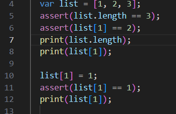

    hasil output

    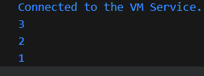

    _penjelasan_

    var list digunakan untuk mengisi list dengan tiga elemen. assert(list.length == 3): Memastikan panjang list adalah 3. 
    Jika panjang list tidak 3, program akan menghentikan eksekusi (debugging tool).

    assert(list[1] == 2): Memastikan nilai pada indeks ke-1 (yang merupakan elemen kedua) adalah 2.

    print list lenght digunakan untuk mencetak jumlah panjang atau length di dalam list.

    assert(list[1] == 1): Memastikan bahwa nilai pada indeks ke-1 sekarang adalah 1.

* Langkah 3

    kode program

    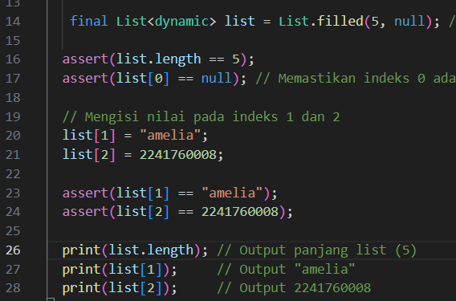

    output
    
    

    _penjelasan_ 
    
    karena yan gdiminta adalah jumlah panjang list adaalah 5, maka kode yang digunakan adalah assert(list.length == 5);

    assert(list[0] == null) digunakan untuk menmastiken indeks ke 0 ada

    list 1 dan 2 digunakn untuk mengisi nama dan nim saya

## Praktium 2

* Langkkah 1

    kode program

    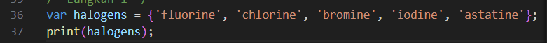

    output

    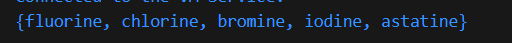

    _penjelasan_ 

    var halogens berisikan beberapa data dalam bentuk string. Penggunaan var dirasa lebih fleksibel dalam pengguanaan beberapa bentuk tipe data. print halogens digunakan untuk mencetak dari isi var halogens.

* Langkah 3

    kode program
    
    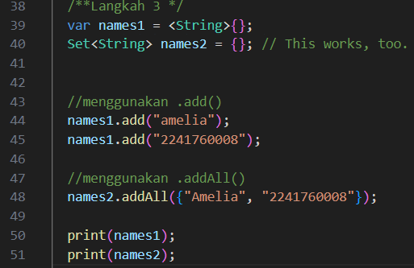

    output
    
    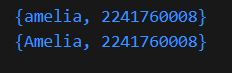

    _penjelasan_ 

    .add() digunakan untuk menambahkan elemen secara individual atau hanya satu elemen yang ditambahkan

    .addAll() digunakan untuk menambahkan ebberapa elemen sekaligus.

## Praktikum 3

* Langkah 1

    kode program
    
    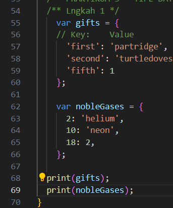

    output
    
    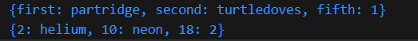

     _penjelasan_

     Map gifts menyimpan String sebagai key dan bisa memiliki nilai String atau integer sebagai value.

    Key (kunci) pada gifts adalah 'first', 'second', dan 'fifth'.
    
    Value (nilai) yang sesuai dengan key tersebut adalah:
      
    - 'first': 'partridge'
    - 'second': 'turtledoves'
    - 'fifth': 1 (integer)

    Map nobleGases menyimpan integer sebagai key dan bisa memiliki String atau integer sebagai value.

    Key dalam map ini adalah angka 2, 10, dan 18.
    Value yang sesuai dengan key tersebut adalah:
    
    - 2: 'helium'
    - 10: 'neon'
    - 18: 2 (integer)

* Langkah 3

    kode program 
    
    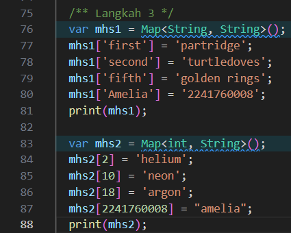

    output
    
    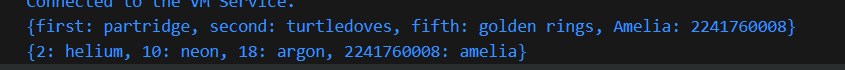

## Praktikum 4

* Langkah 1

    kode program error
    
    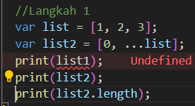

    perbaikan kode program
    
    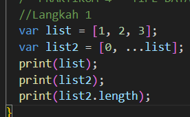

    output
    
    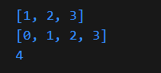

    _penjelasan_

    Terjadi error karena perbedaan nama variabel, pada var nama variabelnya adalah list namun dalam print variabel yang digunakan adalah list1. Sehingga agar bisa dicetak maka varibel pada perintah print diubah sesuai dengan nama variabel dalam var.

    spread operator (...list) digunakan untuk menambahkan semua elemen dari list ke dalam list2, sehingga isi dari list2 adalah 0,1,2,3

* Langkah 3

    kode program error
    
    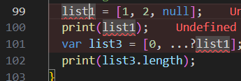

    perbaikan kode
    
    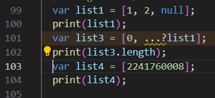

    output
    
    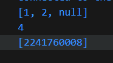

    _penjelasan_ 

    perbaikan pada kode sebelumnya adalah dengan pendeklarasian sebuah variabel list1 dengan var.

    Pada var list 3 terdapat elemen [0, ...?list] hal ini berarti elemen pertama dari list3 adalah angka 0 dan  ...?list1 adalah sintaks yang digunakan untuk menyebarkan (spread) semua elemen dari list1 ke dalam list3 mulai dari indeks ke-1.
    Selanjutnya perintah print list.lenght. Hasil menampilkan 4, karena nilai dari variabel list3 merupakan [0,1,2,null] yang didapat dari penggunaan sintaks ..?list yang menyebarkan semua elemn yang ada di var list1, jumlah elemen di dalam list1 berjumlah 3, sedangkan elemen di dalam list3 berjumlah 3,sehingga jumlahnya ada 4.

* Langkah 4

    perbaikan kode program (ture)
    
    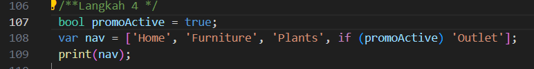

    perbaikan kode program (false)
    
    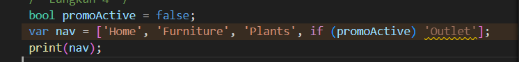

    output true
    
    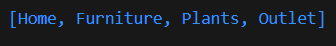

    output false
    
    

    _penjelasan_

* Langkah 5

    kode program
    
    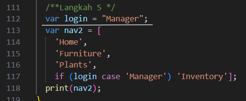

    output
    
    

    _penjelasan_

    pendeklarasian sebuah variabel login dengan nilai "manager". sedangkan pendeklarasian variabel kedua (nav2) berisi array. Diberikan sebuah kondisi yang akan dilakukan pengecekan, jika variabel login memiliki nilai 'manager', maka akan ditambahkan item menu "inventory" ke dalan array nav2. Kemudian perintah print akan dieksekusi dengan menampilkan nilai dari variabel nav2.

* Langkah 6
    
    kode program
    
    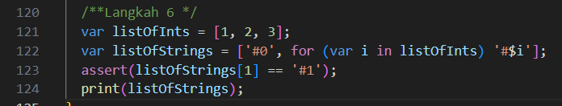

    output
    
    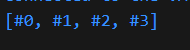

    _penjelasan_

    - var listOfStrings = ['#0', for (var i in listOfInts) '#$i'];

     --> elemen pertama dari listOfString adalah string #0, 
     
    --> for (var i in listOfInts) '#$i' adalah sebuah loop yang akan mengiterasi setiap elemen di listOfInts

    --> Pada setiap iterasi, sebuah string baru akan dibuat dengan format "#i", di mana i adalah nilai dari elemen saat ini dalam listOfInts. String baru ini kemudian ditambahkan ke listOfStrings.

    - assert(listOfStrings[1] == '#1');

    --> assert yang akan mengecek apakah elemen kedua dari listOfStrings (dengan indeks 1) sama dengan "#1". Jika kondisi ini benar, maka program akan berjalan terus. Jika salah, maka program akan berhenti dan menampilkan pesan error.
## Praktikum 5

* Langkah 1
    
    kode program
    
    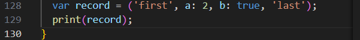

    output 
    
    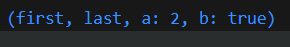

    _penjelasan_ 

    variabel record memiliki beberapa tipe data yang bisa disimpan, yaiutu string, int dan bool. ketika dilakukan print pemanggilan variabel record, maka akan ditampilkan hasil data yang ada di dalam var record.

* langkah 3

    Kode program 
    
    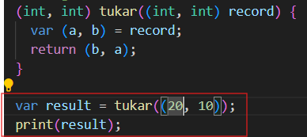

    output
    
    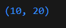

    _penjelasan_

    (int, int) tukar : mendeklarasikan sebauh fungsi yang memiliki nama "tukar" yang kana mengembalikan dua tipe nilai bertipe integer.

    (int, int) record : Fungsi yang digunakan untuk menerima satu parameter berupa tuple (pasangan nilai) yang berisi dua bilangan bulat.

    return (b,a) : fungsi yang digunaakn untuk mengembalikan sebuah tuple yang berisi nilai b (yang awalnya merupakan nilai kedua) menjadi posisi pertama, dan nilai a ( yang awalnya merupakan nilai pertama) menjadi posisi kedua. Atau dengan kata lain nilai dari a dan b ditukar.

* Langkah 4

    kode program 
    
    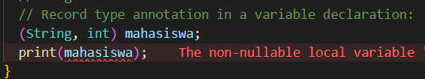

    perbaikan kode program
    
    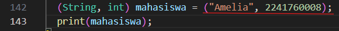

    output
    
    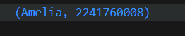

    _penjelasan_

    sebelum dilakukan pernaikan kode program terjadi error karena variabel belum dideklarasikan. Variabel mahasiswa harusnya memiliki dua variabel yang bertipe data string dan yang kedua int. Ketika variabel sudah dideklarasikan sesuai dengan tipe data, maka variabel mahasiswa bisa dipanggil.

* Langkah 5

    kode porgram
    
    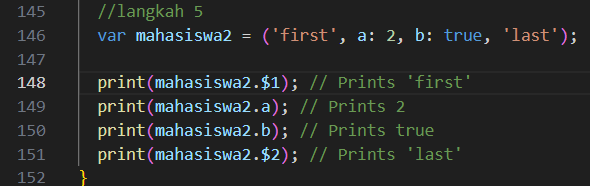

    output
    
    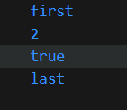

    _penjelasan_

    variabel yang memiliki tipe data int atau bool ketika melakukan pemanggilan variabel langsung tanpa menggunakan simbol dolar $, namun ketika tipe data variabel dideklarasikan dengan tipe data string maka pemanggilan dialkukan dnegan mengguankan tanda dolar .

    kode program | nim dan nama
    
    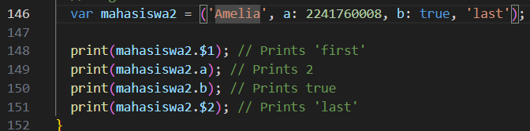

    output
    
    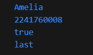

    _penjelasan_

    Kode ini menunjukkan cara untuk membuat sebuah struktur data sederhana yang mirip dengan array atau objek dalam bahasa pemrograman lain. Dapat digunakan untuk menyimpan berbagai jenis data dalam satu variabel dan mengaksesnya dengan cara yang berbeda-beda.

## Tugas Praktikum
1. Silakan selesaikan Praktikum 1 sampai 5, lalu dokumentasikan berupa screenshot hasil pekerjaan Anda beserta penjelasannya!

2. Jelaskan yang dimaksud Functions dalam bahasa Dart!

    *jawab :*
Function ini merupaakn sebuah blok perilaku atau behavior terhadap tugas tertentu. Dalam dart terdapat 2 kategori function, yaitu
* Built-in Function (Fungsi yang sudah ada di Dart)
function ini merupakan bawaan library dari dart itu sendiri, sehingga cukup memanggil nama fungsi tersebut sesuai kebutuhan

* user-defined functions (Fungsi yang dibuat oleh programmer).
Setiap fungsi di Dart selalu mengembalikan nilai namun ada satu tipe data khusus yang bisa kita lihat pada fungsi main sebelumnya yakni return type nya adalah void.

3. Jelaskan jenis-jenis parameter di Functions beserta contoh sintaksnya!

    *jawab :* 

* positional parameters, Urutan dan jumlah nilai yang diberikan selama panggilan harus sesuai dengan urutan dan jumlah parameter dalam tanda tangan fungsi.

* Named parameters, memungkinkan untuk memebrikan nilai ke parameter tertentu dengan menyebutkan namanya secara eksplisit. Fleksibilitas ini sangat berguna saat menangani fungsi yang memiliki banyak parameter atau saat urutan parameter tidak jelas.
* Named parameters with default values, dengan menambahlkan nilai default ke parameter yang bernama bisa membuat fugsi yang dibuat lebih fleksibel. Jika suatu nilai tidak diberikan selama pemanggilan fungsi, nilai default akan digunakan. Hal ini sangat berguna saat menangani parameter opsional.

* Named parameters with required values, Kata kunci required memastikan bahwa parameter tertentu harus disediakan selama pemanggilan fungsi.

* Optional positional parameters, parameter ini memungkinakan pengguna untuk membuat fungsi lebih serbaguna dengan menjadikan parameter tertentu opsional selama pemanggilan fungsi. Fleksibilitas ini berguna saat menangani fungsi yang tidak memerlukan semua parameter.

4. Jelaskan maksud Functions sebagai first-class objects beserta contoh sintaknya!

    *jawab :* Dart memperlakukan fungsi sebagai objek pertama, yang berarti fungsi dapat diatribusikan ke variabel, dilewatkan sebagai argumen ke fungsi lain, dan dikembalikan dari fungsi. Hal ini memungkinkan penggunaan fungsi sebagai argumen dan nilai balik, yang membuka kemungkinan untuk membuat kode yang lebih dinamis, fleksibel, dan mudah digunakan kembali.

    contoh 

    void main(List<String> args) {

    //Function yang dipassing ke parameter function lainnya.
    
    void printElement(int element) => print(element);
    //Function yang di assign ke variabel
  
    final filter = (int element) => element.isOdd;

    List.generate(100, (index) => index + 1).where(filter).forEach(printElement); }

5. Apa itu Anonymous Functions atau closures? Jelaskan dan berikan contohnya!

    *jawab :* Fungsi ini tidak memiliki nama dan sering digunakan sebagai argumen ke fungsi lain atau dalam operasi tertentu seperti iterasi dengan metode forEach() atau transformasi elemen dalam koleksi dengan metode map(). Closures juga dapat menangkap variabel dari lingkup leksikal mereka, yang memungkinkan untuk enkapsulasi data dan fungsionalitas secara lebih baik.

    contoh 

    void main(List<String> args) {
  List.generate(100, (index) => index + 1)
      .where((int item) => item.isEven)
      .forEach((int element) => print('Value: $element'));
}

6. Jelaskan perbedaan Lexical scope dan Lexical closures! Berikan contohnya!

    *jawab :* 
    * Lexical scope : Fitur dalam Dart yang menentukan cakupan variabel berdasarkan tata letak kodenya.
    
    contoh

    void main() {
    var outerVariable = 'I am outside the function';

    void innerFunction() {
    
    var innerVariable = 'I am inside the function';
    
    print(outerVariable);  // Bisa mengakses outerVariable karena ada dalam lingkup yang sama
    
    print(innerVariable);  // Mengakses innerVariable
    }

    innerFunction();
  
    // print(innerVariable);  // Error! innerVariable tidak bisa diakses di luar innerFunction
}

    * lexical clodures :  fungsi yang menyertakan referensi (variabel) ke cakupan luarnya. Fungsi ini memungkinkan fungsi untuk mengakses variabel di luar cakupannya.

    contoh 

    Function createCounter() {
  var count = 0;  // Variabel dari lingkup luar (enclosing scope)
  
     return () {
    count += 1;
    return count;
  };
}

    void main() {
  var counter = createCounter();  // Menghasilkan closure
  
    print(counter());  // Output: 1
    print(counter());  // Output: 2
     print(counter());  // Output: 3
}

7. Jelaskan dengan contoh cara membuat return multiple value di Functions!

    *Jawab :* Di dalam dart untuk mengembalikan lebih dari satu nilai fungsi bisa dengan menggunakan record atau struktur data seperti list atau map   

* data list, digunakan untuk mengemballikan beberapa nilai dari fungsi. Data list lebih fleksibel karena bisa mengembalikan lebih dari dua nilai, namun kedua tipe data harus sama. Contoh. 

    List<dynamic> getCoordinates() {
    
    double x = 10.5;
    
    double y = 20.5;

  return [x, y];  // Mengembalikan list dari dua nilai }

  void main() {
  
  var coordinates = getCoordinates();
  
  print('X: ${coordinates[0]}');  // Output: X: 10.5
  
  print('Y: ${coordinates[1]}');  // Output: Y: 20.5
}

* Data Maps, bisa digunakan ketika akan mengembalikan ebberapa nilai dengan tipe data yang berbeda dan memberi nama pada nilai-nilai tersebut.
contoh.

    Map<String, dynamic> getUserData() {
  
  String name = 'Amelia';
  
  int nim = 2241760008;
  
  return {
    'name': name,
    'nim': nim,
  };  // Mengembalikan map dengan beberapa nilai
}

    void main() {
 
  var userData = getUserData();
  print('Name: ${userData['name']}');  // Output: Name: Amelia
  
  print('NIM: ${userData['nim']}');    // Output: NIM: 2241760008
}

8. Kumpulkan berupa link commit repo GitHub pada tautan yang telah disediakan di grup Telegram!

