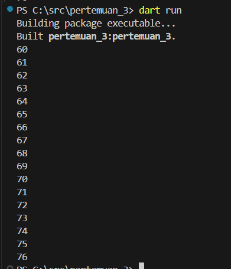
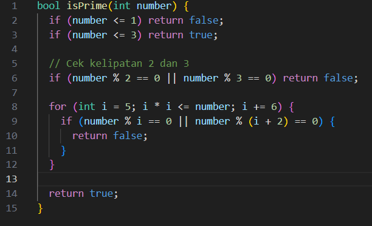

NAMA : AMELIA WAHYU SAFITRI

KELAS : SIB-3D

NIM : 2241760008

*** 
<h1>JOBSHEET 3

## Praktikum 1
* langkah 1

    kode program

    

    hasil output

    

    _penjelasan_
    
    hasil yang keluar adalah **test2 dan test2 again**, karena nilai dari variabel test diinisialisakan dengan "teste". Sehingga ketika nilai variabel 'test' dalam if/else if memiliki equals "test2", maka hasil output yang didatap sesuai dengan perintah print yang ada di dalam if. oleh karena variabel test yang memiliki equals tets2 adalah test2 dan test2 again, sehingga yang keluar adalah test2 dan test2 again.

* langkah 3

    perbaikan kode program 

    

    output

    

    _penjelasan_

    Dengan menambahkan operator perbandingan (==) maka nilai String test sama ersis dengan "true". Ketika pernyataan if bernilai benar atau dengan kata lain variabel test berisi teks "true" maka akan keluar output "kebenaran".

## Praktikum 2

* langkah 1
    
    kode awal

    

    perbaikan kode

    

    output 

    

    _penjelasan_

    langkah awal yang perlu dilakukan adalah dengan menginisialisasi counter, yaitu dengan menambhakan tipe data counter (int) dan juga menginisialisasikan counter itu sendiri. Disini saya menginisisialisasi counter dengan nailai 10, sehingga angka awal yang pertama kali muncul ketika dijalankan adalah 10 dan berhenti sebelum 33 karena perintah perulangan while hanya akan mengeksekusi ketika nilai counter kurang dari 33. 

* langkah 3

    kode prorgam

    

    output
    
    

    _penjelasan_
    
    Ketika melakukan inisialisasi, variabel counter saya isi dengan nilai 60. Pada perulangan ini karena nilai counter lebih besar dari 33 maka perintah do-while yang akan dieksekusi, perintah while tidak dieksekusi karena nilai dari variabel counter lebih besar dari 33 (60 > 33). Perintah do-while, yang dijalankan terlebih dahulu adalah perintah while, apakah nilai counter kurang dari 77? jika ya maka akan dilakukan print nilai counter. namun jika tidak maka tidak ada hasil yang dikeluarkan. counter akan terus bertambah hingga batas while (77).

## Praktikum 3

* langkah 1

    kode awal

    

    perbaikan kode

    

    output 

    

     _penjelasan_
    
    variabael index belu memiliki tipe data, sehingga perlu ditambhakan tipe data yaitu int. kemudian di dalam bahasa pemrograman penggunaan _uppercase_ tidak terlalu diperhatikan, oada umumnya penulisan variabel menggunakan lowercase. Kemudian pada variabel index belakang perlu ditambah ++ sebagai increment

* langkah 3 

    perbaikan kode program

    
    
    output

    

     _penjelasan_

    kode program tersebut dimasukkan ke dalam perulangan for. break digunakan untuk keluar dari loop secara paksa apabila nilai dari variabel index adalah sama denagn 21. namun ketika nilai variabel index bernilai lebih dari satu dan kurang dari 7 maka perulangan else if akan terus dilakukan.
    
## Tugas
kode program pada folder bin

kode program pada folder lib

output

## Tugas Tambahan

hasil 
* inputan pada hasil program

*output setelah dilakukan input pada program

